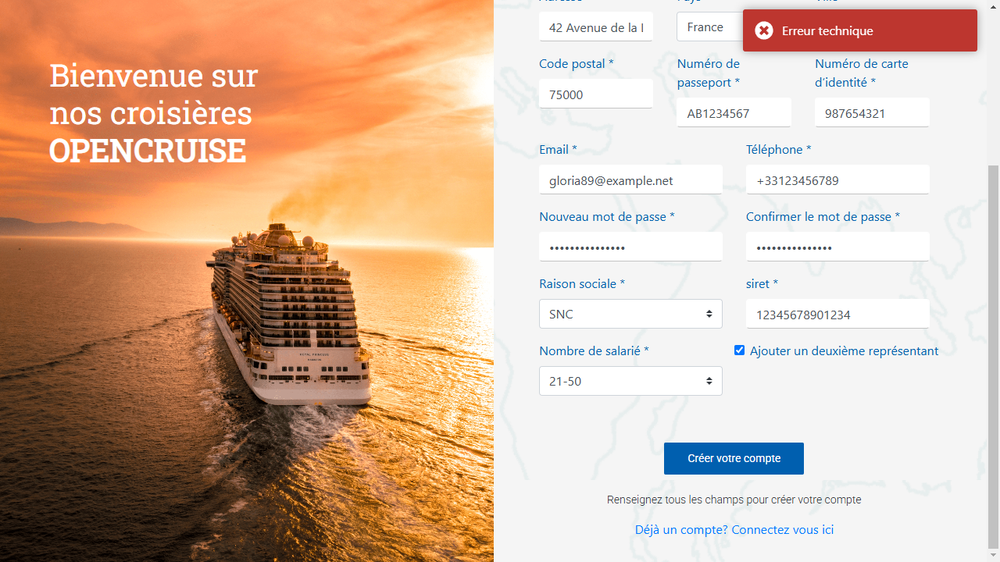

# 🐞 Anomalie Critique – Création de compte professionnel avec représentant

## 📌 Référence

**ID :** BUG-OPENCRUISE-REGPRO-01  
**Titre :** Erreur technique lors de la création d’un compte professionnel avec représentant – Environnement OK

---

## 🧪 Contexte

L'anomalie a été détectée lors d'un test automatisé (Playwright + pytest) visant à valider le parcours de création de compte professionnel avec ajout d'un représentant. Le scénario est conforme à la documentation fonctionnelle.

---

## 🛠️ Environnement concerné

| Paramètre     | Valeur                             |
| ------------- | ---------------------------------- |
| Type de test  | End-to-End (E2E) automatisé        |
| Outil         | Playwright (Python)                |
| Environnement | **OK** (pré-production stable)     |
| Exécution     | GitHub Actions + Local             |
| Navigateur    | Chromium (headless)                |
| Données       | Faker (données aléatoires valides) |

---

## 📋 Étapes de reproduction

1. Aller sur la page de connexion `/login?returnUrl=%2F`
2. Cliquer sur "Vous n’avez pas de compte ?" puis sélectionner **Professionnel**
3. Remplir intégralement le formulaire principal (SIRET, adresse, mot de passe…)
4. Cocher la case "Ajouter un deuxième représentant"
5. Remplir le formulaire du représentant avec des données valides
6. Cliquer sur le bouton **"Créer votre compte"**
7. ⚠️ Une **erreur technique** s’affiche en haut de l'écran

---

## 📎 Capture d'écran

---

## ✅ Résultat attendu

- Le compte professionnel est créé
- L'utilisateur est redirigé vers la page de connexion
- Un message de confirmation est affiché

## ❌ Résultat obtenu

- Une **erreur technique** s’affiche sans détail
- Aucun compte n'est créé (ni dans l’interface admin, ni par requête API visible)
- Aucune validation client ne remonte d’erreur sur les champs

---

## 🧠 Analyse et hypothèses

- Le formulaire est visuellement bien rempli
- Le bouton est bien déclenché (événement détecté par Playwright)
- Le problème semble survenir **après la soumission** : vraisemblablement au niveau du **serveur** (erreur 500 ou règle métier non gérée)
- Aucun message fonctionnel ne précise la nature de l’erreur

---

## 🧨 Impact et risques métier

| Élément                | Conséquence                                 |
| ---------------------- | ------------------------------------------- |
| Utilisateur concerné   | Tous les professionnels avec représentant   |
| Fonction bloquée       | Inscription (onboarding)                    |
| Environnement concerné | **OK** – Pré-prod censée être stable        |
| Type de bug            | Backend/API ou validation métier            |
| Risque en production   | 🟥 **Élevé** – Rupture de parcours critique |

---

## 🚨 Gravité

**🟥 Critique (Bloquante)**  
➡️ Aucun professionnel ne peut créer de compte s’il ajoute un représentant  
➡️ Cela empêche l’entrée de nouveaux clients dans la plateforme

---

## 📦 Données utilisées (exemple)

| Champ                      | Valeur               |
| -------------------------- | -------------------- |
| Email (pro + représentant) | gloria89@example.net |
| SIRET                      | 12345678901234       |
| Passeport                  | AB1234567            |
| ID carte                   | 987654321            |
| Mot de passe               | **\*\*\*\***         |
| Pays / Ville               | France / Paris       |

Les données sont générées dynamiquement à chaque test via [Faker](https://faker.readthedocs.io/en/master/).

---

## ✅ Reproductibilité

- [x] En test automatisé CI
- [x] En exécution locale (Playwright)
- [x] En reproduction manuelle
- [x] Données valides à chaque essai

---

## 💡 Recommandation

- Analyser les **logs serveurs** sur l’appel déclenché par le bouton "Créer votre compte"
- Vérifier la **validité métier** de la combinaison de données (SIRET + représentant)
- Implémenter une **gestion d’erreur explicite** côté client (message fonctionnel, logs visibles)
- Ajouter une **couverture de test back/API** sur ce point

---

## ✍️ Rédigé par

**Daura Rady**  
QA Fonctionnelle & Automatisation Python  
Date : 09/04/2025
