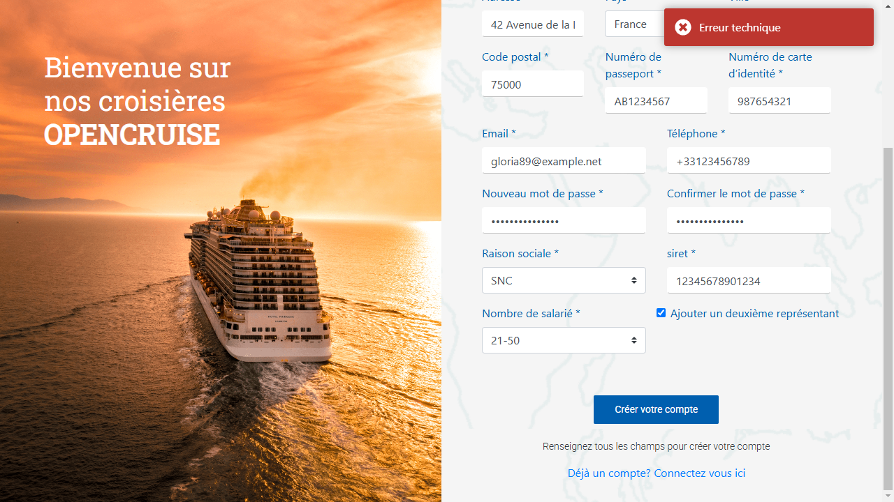

# 🚨 Déclaration des Anomalies – OpenCruise

## 📌 Objectif

Ce document liste les **anomalies détectées** lors des tests et leur **impact métier**.

---

## 🔴 Anomalie 1 : Création de compte impossible en environnement KO

- **Impact** : Les utilisateurs ne peuvent pas s'inscrire, bloquant l'accès à la plateforme.
- **Cause probable** : Échec de validation côté serveur.
- **Reproduction** :
  1. Accéder à la page d'inscription.
  2. Remplir les champs obligatoires.
  3. Cliquer sur "Créer un compte".
- **Résultat attendu** : Le compte est créé et validé.
- **Résultat obtenu** : Aucun compte créé.
- **Action recommandée** : Analyse des logs backend.

📸 **Screenshot** :

---

## 🔴 Anomalie 2 : Impossibilité d'ajouter un deuxième représentant (KO)

- **Impact** : Limitation pour les entreprises qui nécessitent plusieurs représentants.
- **Cause probable** : Fonctionnalité absente ou désactivée en KO.
- **Reproduction** :
  1. Accéder à la page d'inscription.
  2. Remplir les champs obligatoires.
  3. Tenter d’ajouter un deuxième représentant.
- **Résultat attendu** : L’ajout du représentant est possible.
- **Résultat obtenu** : Aucune option pour ajouter un représentant.
- **Action recommandée** : Vérification de l’implémentation et activation de la fonctionnalité.

📸 **Screenshot** :

---

## 🔴 Anomalie 3 : Erreur technique lors de la création de compte professionnel avec représentant (environnement OK)

- **Impact** : Blocage total du parcours d'inscription professionnel dès qu’un représentant est ajouté.
- **Gravité** : 🟥 **Bloquante** – l'inscription échoue même avec des données valides.
- **Environnement** : OK (pré-prod stable)
- **Cause probable** : Erreur serveur non gérée ou règle métier backend silencieuse.
- **Reproduction** :
  1. Accéder à l'inscription pro.
  2. Remplir tous les champs + ajouter un représentant.
  3. Cliquer sur "Créer votre compte".
- **Résultat attendu** : Le compte est créé, redirection vers login.
- **Résultat obtenu** : Message "Erreur technique" en haut de l’écran. Aucun compte créé.
- **Action recommandée** :
  - Analyser les logs backend pour identifier le blocage
  - Implémenter un retour utilisateur plus clair
  - Vérifier la validité métier de la combinaison Pro + Représentant

📸 **Screenshot** :

📄 **Détails complets disponibles dans le fichier** :  
📁 [docs/BUG_PRO_creation_compte_representant.md](./BUG_PRO_creation_compte_representant.md)

---

📌 **Ces anomalies sont également documentées dans le [Rapport de Campagne](./rapport_campagne.md).**
