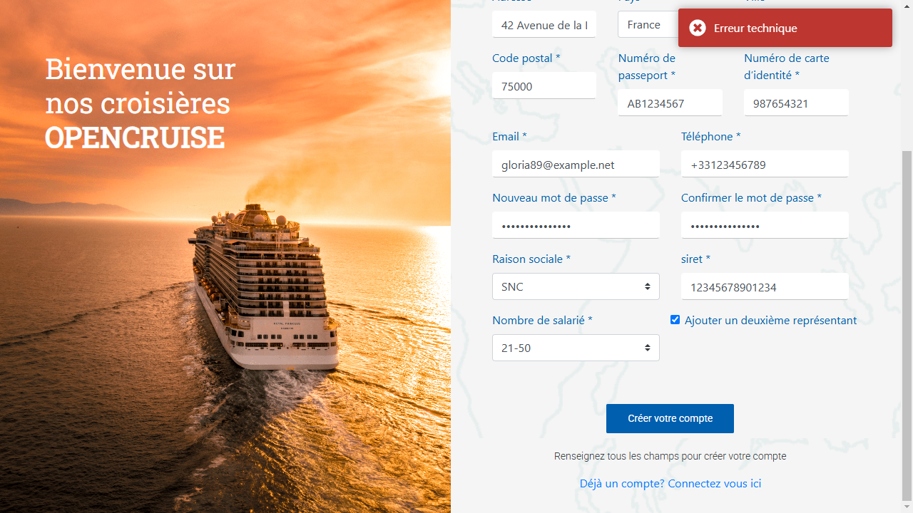

# 📝 Rapport de Campagne de Test – OpenCruise

## 📌 1. Synthèse (Executive Summary)

### 🎯 **But du projet**

- Automatiser les tests Web d’OpenCruise sur deux environnements :
  - ✅ [OK] https://opencruise-ok (version stable)
  - ❌ [KO] https://opencruise-ko.(version défectueuse)
- Garantir le bon fonctionnement des fonctionnalités critiques : **création de compte**, **connexion**, **approbation**, **blocage de compte**.
- Identifier les anomalies avant mise en production.

---

### 💡 **Valeur ajoutée**

- Réduction du temps de test manuel
- Gain de fiabilité avec l’exécution CI/CD via GitHub Actions
- Traçabilité des anomalies détectées avec preuve (screenshot + reproduction)

---

### 🎯 **Objectif de la campagne**

Valider les parcours clés suivants :

- Création de compte (professionnel + particulier)
- Approbation par l’admin
- Connexion
- Blocage du compte après 5 tentatives échouées

---

### 📊 **Résumé des résultats**

| **Indicateur**            | **Valeur**               |
| ------------------------- | ------------------------ |
| Cas de tests définis      | 15                       |
| Cas exécutés              | 4                        |
| Cas passants              | 3                        |
| Cas en échec              | 1                        |
| Fonctionnalités couvertes | 4/5 (80%)                |
| Bugs bloquants détectés   | 3                        |
| Régressions détectées     | ✅ Oui (voir Anomalie 3) |

---

## 🖥️ 2. Contexte du Test

| Élément             | Détail                                |
| ------------------- | ------------------------------------- |
| Application         | OpenCruise                            |
| Date d’exécution    | 09 avril 2025                         |
| Durée de campagne   | 1h15                                  |
| Navigateur          | Chromium (headless via Playwright)    |
| OS                  | Windows 11 + GitHub Ubuntu Runner     |
| Version testée      | V2.6                                  |
| Environnement ciblé | OK et KO                              |
| Méthode             | Risk-Based Testing + BDD (pytest-bdd) |
| CI/CD               | GitHub Actions                        |

---

## ✅ 3. Résultats des Tests

### 📋 **Tableau récapitulatif**

| **ID Test** | **Description**                                   | **Environnement OK**                              | **KO**                           | **Gravité** |
| ----------- | ------------------------------------------------- | ------------------------------------------------- | -------------------------------- | ----------- |
| T001        | Création + approbation compte pro + login         | ✅ Pass                                           | ❌ Fail – compte non créé        | Critique    |
| T002        | Création + approbation compte particulier + login | ✅ Pass                                           | ❌ Fail – compte non créé        | Critique    |
| T003        | Blocage du compte après 5 tentatives échouées     | ✅ Pass                                           | N/A – pas de compte créé         | Mineur      |
| T004        | Création compte pro avec représentant             | ❌ **Fail (Erreur technique)** ❗️ **Régression** | ❌ Fail – fonctionnalité absente | Bloquant    |

---

## 🔎 4. Analyse des Anomalies

### 🔴 Anomalie 1 – Création de compte KO (pro et particulier)

- **Impact** : Les utilisateurs ne peuvent pas s’inscrire → blocage total du service
- **Cause probable** : Validation backend ou base de données KO
- **Reproduction** : Inscription simple, clic sur "Créer un compte"
- **Résultat** : Aucun compte créé, pas de redirection
- **Gravité** : Bloquante

📸 Screenshot :

---

### 🔴 Anomalie 2 – Pas d’ajout de 2e représentant en KO

- **Impact** : Empêche les entreprises multi-représentants de s’inscrire
- **Cause probable** : Fonction non déployée ou désactivée
- **Gravité** : Moyenne

📸 Screenshot :

---

### 🔴 Anomalie 3 – **Régression** : erreur technique en **OK** lors de l’inscription pro avec représentant

- **Impact** : Le parcours de création pro **ne fonctionne plus en OK**, alors qu’il fonctionnait correctement le mois dernier
- **Contexte** : Même jeu de données, même scénario, testé avec succès en mars 2025
- **Symptôme** : Clic sur "Créer votre compte" → **erreur technique serveur** (aucun message fonctionnel)
- **Reproduction** :
  1. Remplir le formulaire professionnel
  2. Ajouter un représentant avec des données valides
  3. Cliquer sur "Créer votre compte"
- **Résultat** : Erreur technique, aucun compte créé, aucune redirection
- **Gravité** : 🟥 Bloquante – **non-conformité critique en environnement stable**
- **Hypothèse** :
  - Régression backend
  - Règle métier ajoutée non communiquée
  - Données bloquantes non validées

📸 Screenshot :

📄 Rapport complet : [docs/BUG_PRO_creation_compte_representant.md](./docs/BUG_PRO_creation_compte_representant.md)

---

## 🧠 5. Justification des fonctionnalités automatisées

| Fonction            | Pourquoi automatisée ?                 |
| ------------------- | -------------------------------------- |
| Création compte     | Parcours clé d’acquisition utilisateur |
| Approbation admin   | Processus métier critique              |
| Connexion / blocage | Couverture sécurité + accessibilité    |

Fonctionnalités non encore couvertes :

- Réservations (logique métier trop dynamique)
- Paiements (tests manuels prévus avant industrialisation)

---

## 🔧 6. Conception des tests

**Méthodologie** :

> Risk-Based Testing (selon ISTQB)  
> → Focus sur les parcours à **fort impact métier** et **haute fréquence d’usage**

**Outils** :

- `pytest`, `playwright`, `pytest-bdd`
- `allure-pytest` pour les rapports
- `GitHub Actions` pour l'intégration continue

---

## 🏁 7. Conclusion & Recommandations

### 🚨 Points critiques à corriger

1. **Corriger la régression** sur la création de compte pro avec représentant en environnement OK
2. Restaurer la **création simple** sur l’environnement KO
3. Déployer la fonctionnalité d’**ajout de représentant en KO**

### 📌 Recommandations

- Intégrer un test **API** côté backend pour confirmer les règles bloquantes
- Remonter une **anomalie officielle** via JIRA ou fichier d’incident
- Étendre l’automatisation aux cas non passants et aux tests de réservation

---

📎 Rapport validé le **09 avril 2025**  
✍️ Rédigé par **Daura Rady – QA Fonctionnelle & Automatisation**
